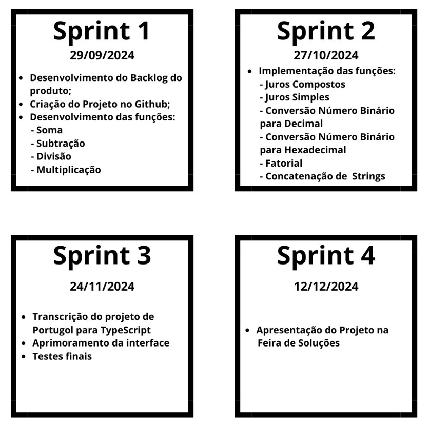

Repositório para o projeto da calculadora cientifica. 

Por favor sigam as instruções do card de GITHUB quando forem fazer as alterações.

User stories: 
https://github.com/orgs/API-FATEC-2024/projects/1

# Contexto e Objetivo do Projeto 🎯

Nós, alunos do 1° semestre do curso de Banco de Dados da Faculdade de Tecnologia Jessen Vidal, desenvolvemos esse projeto de Calculadora Científica com o propósito de desenvolver e aprimorar nossa capacidade de pensamento lógico voltado para a programação. O objetivo principal do projeto é desenvolver uma calculadora que realize as operações matemáticas básica, além de operações como cálculo fatorial, operação de cálculo de função de segundo grau, concersão de bases numéricas, concatenação de 2 strings e função de Juros Simples e Juros Compostos. 

# Funcionalidades do projeto 🔨

- `Funcionalidade 1`: Calculo das funções básicas: Soma, Subtração, Multiplicação e Divisão
- `Funcionalidade 2`: Calculo de Fatorial
- `Funcionalidade 3`: Calculo de Função de Segundo Grau
- `Funcionalidade 4`: Calculo de Juros Simples e Juros Compostos
- `Funcionalidade 5`: Conversão de número Binário para Decimal vice e versa
- `Funcionalidade 6`: Conversão de número Binário para Hexadecimal vice e versa
- `Funcionalidade 7`: Concatenação de 2 strings

# Cronograma 📅 

O projeto foi divido em 4 entregas, sendo 3 sprint e a entrega final a apresentação na Feira de Soluções, para o gerenciamento e acompanhamento das entregas foi utilizado o próprio Github.

